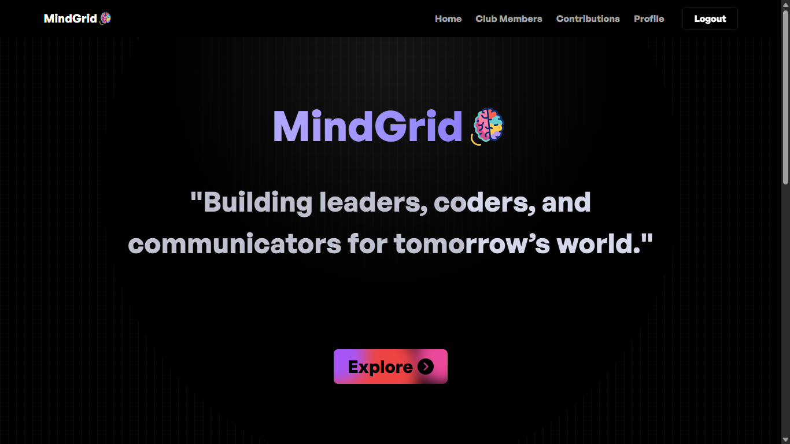
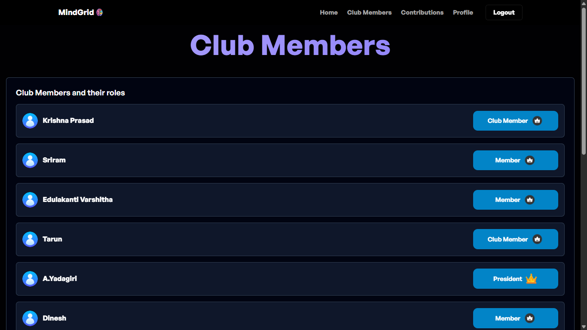
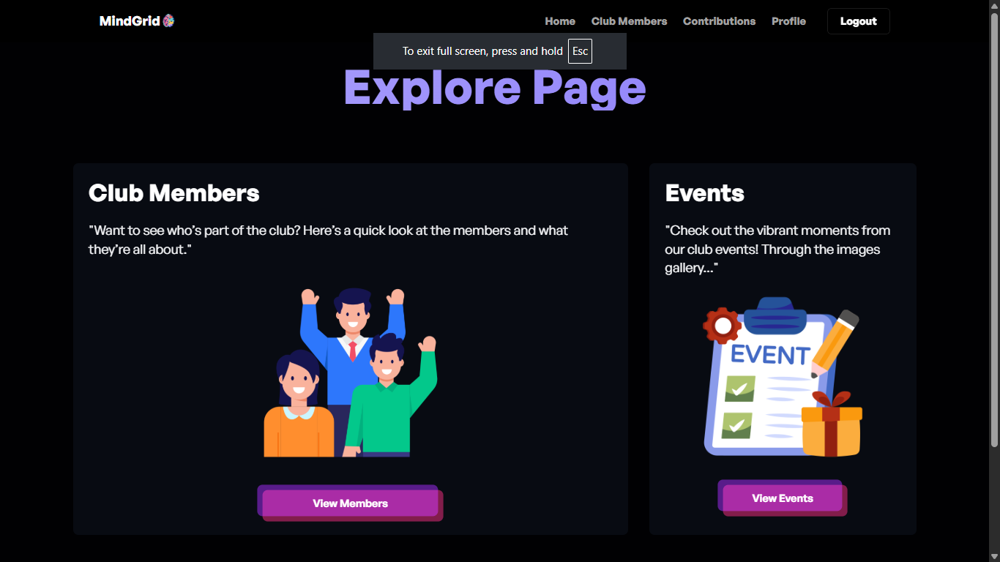
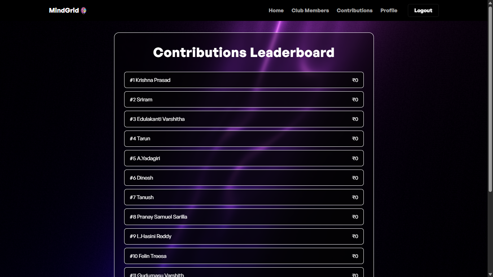
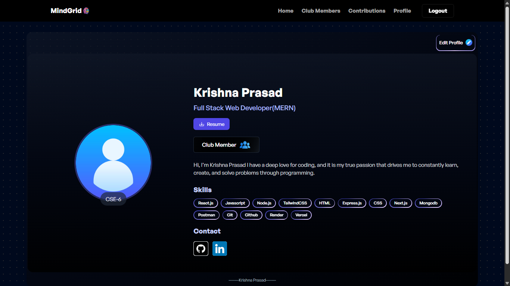

# MindGrid

MindGrid is a full-stack club management platform that centralizes member onboarding, profile management, contributions tracking, projects showcase, and event management.

## Live Demo

https://mindgrid-gnu.vercel.app

## Core Features

- Secure authentication with JWT-based login and protected routes
- Controlled signup flow using an allowed-members list
- Member directory for viewing registered club members
- Personal profile page with editable user information
- Contributions module to track and display member activity
- Projects module with create, list, view, edit, and feature-toggle workflows
- Events module with create, list, view, edit, and feature-toggle workflows
- Responsive frontend with reusable UI sections and smooth interactions

## Tech Stack

### Frontend

- React 19 with Vite
- React Router
- Axios
- Tailwind CSS
- Framer Motion

### Backend

- Node.js
- Express
- MongoDB with Mongoose
- JWT authentication
- bcrypt password hashing
- Joi request validation

## Project Structure

```text
mindgrid/
|-- backend/
|   |-- config/
|   |-- Controllers/
|   |-- Middlewares/
|   |-- Models/
|   |-- Routes/
|   |-- uploads/
|   |-- index.js
|   `-- package.json
|-- frontend/
|   `-- MindGrid/
|       |-- public/
|       |-- src/
|       |   |-- config/
|       |   |-- constants/
|       |   `-- sections/
|       |-- index.html
|       `-- package.json
|-- assets/
`-- README.md
```

## Getting Started

### Prerequisites

- Node.js 20 or later
- MongoDB Atlas URI or local MongoDB instance

### 1) Clone and Install

```bash
git clone https://github.com/your-username/mindgrid.git
cd mindgrid

# Backend
cd backend
npm install

# Frontend
cd ../frontend/MindGrid
npm install
```

### 2) Configure Environment Variables

Create a `.env` file in `backend/` with the following values:

```env
PORT=5000
MONGO_URI=your_mongodb_connection_string
JWT_SECRET=your_jwt_secret
SALT_ROUNDS=10
ADMIN_EMAIL=your_admin_email@example.com
DISABLE_MEMBERSHIP_CHECK=false
```

### 3) Run the Application

```bash
# Terminal 1: backend
cd backend
npm start

# Terminal 2: frontend
cd frontend/MindGrid
npm run dev
```

Frontend: http://localhost:5173  
Backend health check: http://localhost:5000/health

## API Surface (High Level)

- Auth routes: signup, login, membership check
- Members routes: list member information
- Profile routes: get and update profile data
- Contributions routes: create and fetch contributions
- Projects routes: create, read, update, and feature project records
- Events routes: create, read, update, and feature event records

## Screenshots







## Author

Krishna Prasad  
Portfolio: https://krishnaprasad.space  
GitHub: https://github.com/KrishnaPrasad-dev  
LinkedIn: https://www.linkedin.com/in/krishnaprasad-webdev
